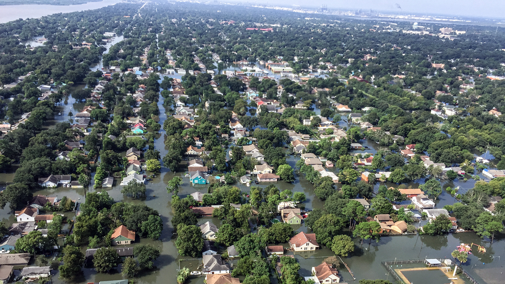
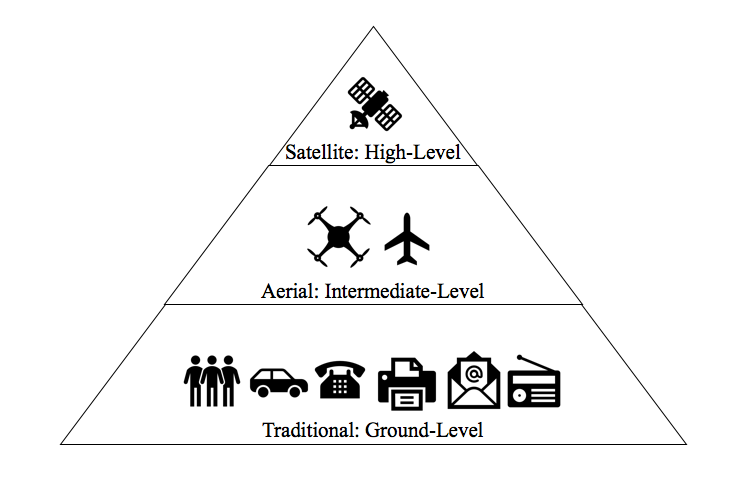

Source: [National Oceanic and Atmospheric Association (NOAA)](http://rammb.cira.colostate.edu/ramsdis/online/images/loop_of_the_day/goes-16/20170828000000/video/20170828000000_harveyir.gif) 

Global climate change from greenhouse gas emissions is causing an increase in the intensity and frequency of hurricane events.  Evidence for this is presented by the [Intergovernmental Panel on Climate Change (IPCC)](http://www.ipcc.ch/report/ar5/wg1/).  According to Datafloq, hurricanes Harvey, Irma and Maria alone impacted upwards of 26.5 million people in the US in 2017, so improving disaster response after hurricanes would have a far-reaching effect.  

Flooding on the outskirts of Houston, Texas, August 31, 2017 (Photo credit: [South Carolina National Guard](https://www.planet.com/insights/anatomy-of-a-catastrophe/))

Even with advances in predicting when and where hurricanes will occur, increased urbanization combined with aging infrastructure is putting a significant number of people at risk.  One quarter of the world's population lives within 100 km of a coastline, areas which are more susceptible to flooding and sea level rise (IPCC).  One implication for emergency managers is the pressing need to develop a tool that is faster than the weeks it can take for damage assessment using windshield surveys, which are systematic observations recorded from a moving vehicle. 
A tool that can automatically detect damages from post-hurricane satellite imagery could reduce the time required for damage assessment to 24 hours.  This could serve to triage and further optimize disaster response efforts.

Effective disaster response relies on several levels of information.  Automatic damage detection from satellite imagery would work best after disaster events when there is minimal cloudcover and would serve as a speedier supplement to pre-existing ways of assessing damages.

