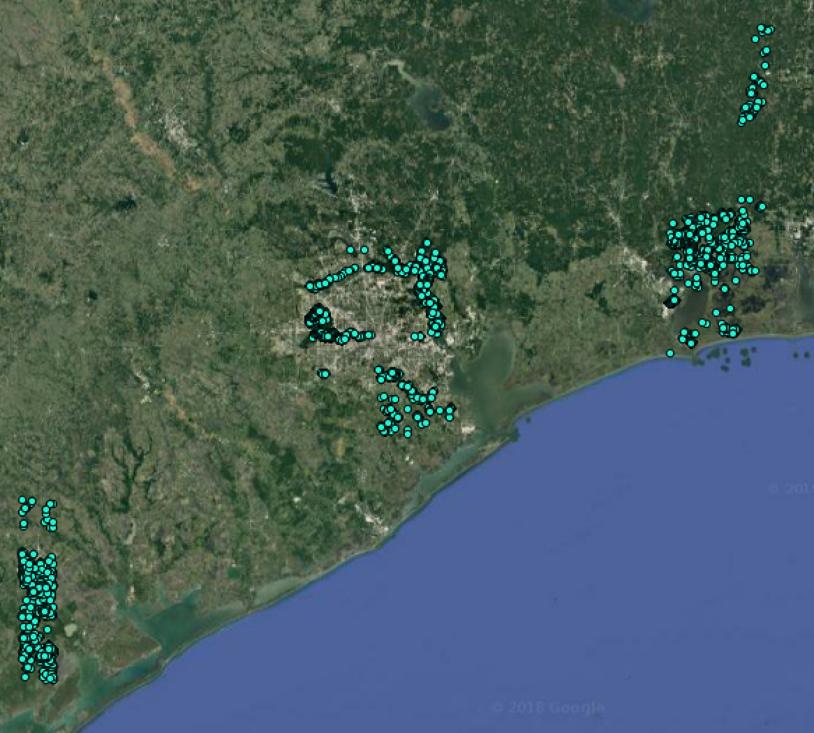
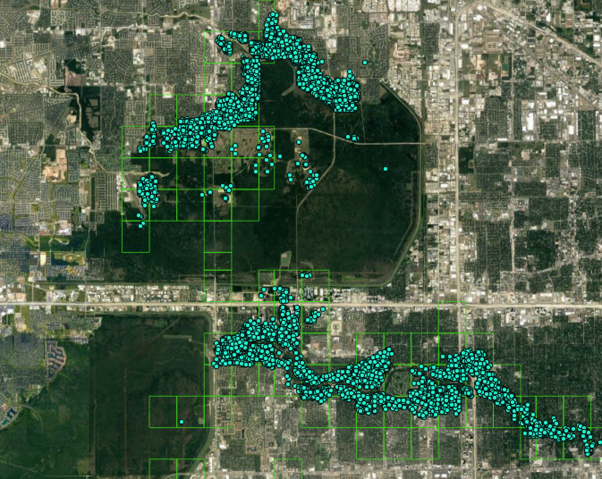
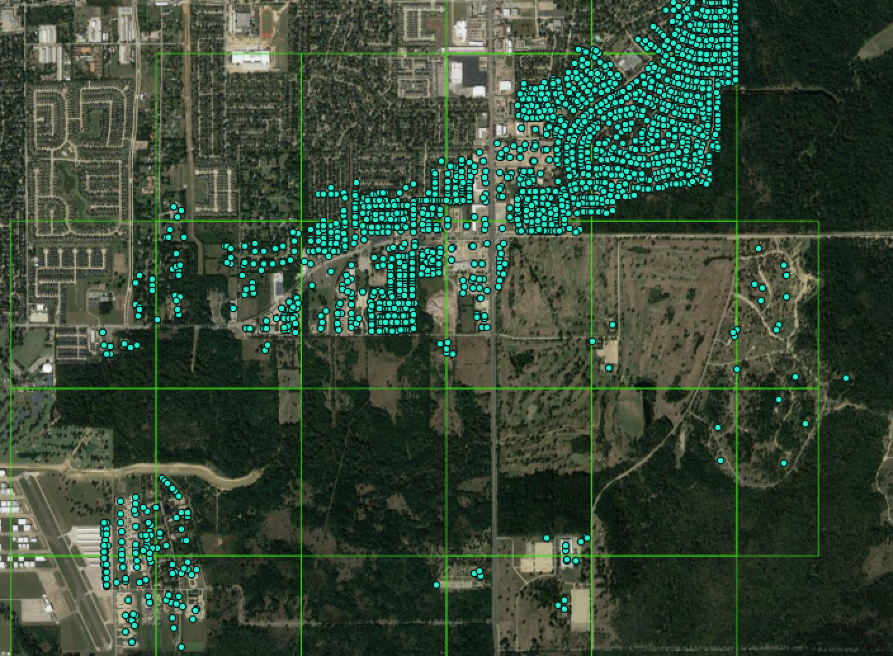
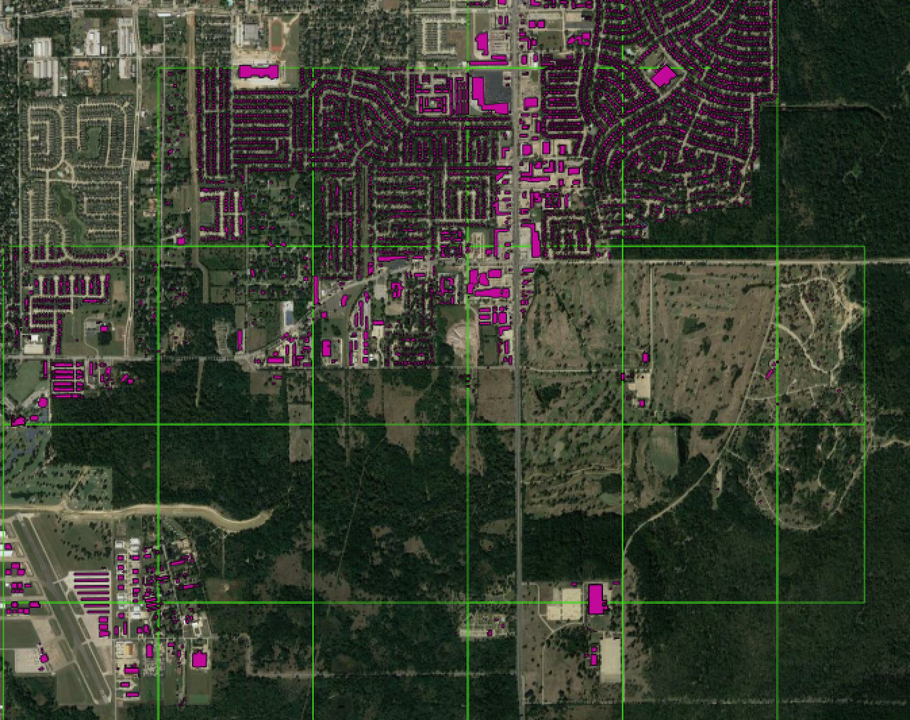
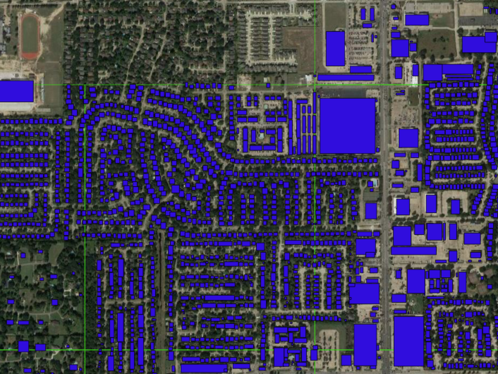

This project utilized [Digital Globe Data](https://www.digitalglobe.com/opendata/hurricane-harvey/post-event) which included Hurricane Harvey tif images and a geojson of volunteer crowdsourced damage annotations from Tomnod.

As our goal was to train a model to automatically detect damages in post-hurricane satellite imagery, we needed to gather all data required for our chosen machine learning algorithms: SSD and Faster R-CNN.  Since these required bounding boxes around the annotated points, we gathered parcel data and building footprints from the affected counties to create an additional layer from which the bounding boxes for the features (damaged and undamaged buildings) could be generated.  Find more details on the data collection process [here](https://github.com/DDS-Lab/disaster-image-processing/blob/master/data.md).

TOMNOD points (cyan) are downloaded from the Digital Globe website for the study area. Points represent locations of damaged buildings following Hurricane Harvey identified from satellite imagery from TOMNOD volunteers.

The light green boxes represent 2048 X 2048-pixel chips of post-disaster satellite imagery coinciding with areas that were tagged by TOMNOD volunteers. We assume that the imagery contained in these bounds was reviewed by the TOMNOD volunteers to tag damaged buildings.

Let's zoom in to inspect a cluster of annotated points in finer detail.

Microsoft building footprints (purple) [hyperlink] are obtained for the study area. Because coverage of this dataset is not complete around our study area, we also use a building footprints dataset from FEMA (light blue) [hyperlink] where Microsoft building footprints are absent.

Bounding boxes are instantiated as the minimum bounding rectangle (also known as the envelope) of the merged building footprint dataset.

