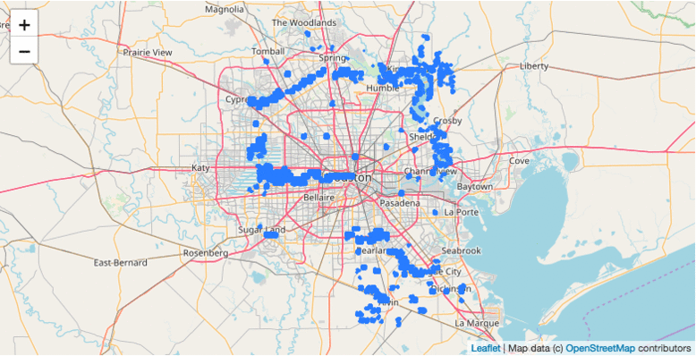

[Digital Globe Data](https://www.digitalglobe.com/opendata/hurricane-harvey/post-event) which included Hurricane Harvey tif images and a geojson of volunteer crowdsourced damage annotations from Tomnod.

As our goal was to train a model to automatically detect damages in post-hurricane satellite imagery, we needed to gather all data required for our chosen machine learning algorithms: SSD and Faster R-CNN.  Since these required bounding boxes around the annotated points, we gathered parcel data and building footprints from the affected counties to create a additional layer from which the bounding boxes could be generated.

