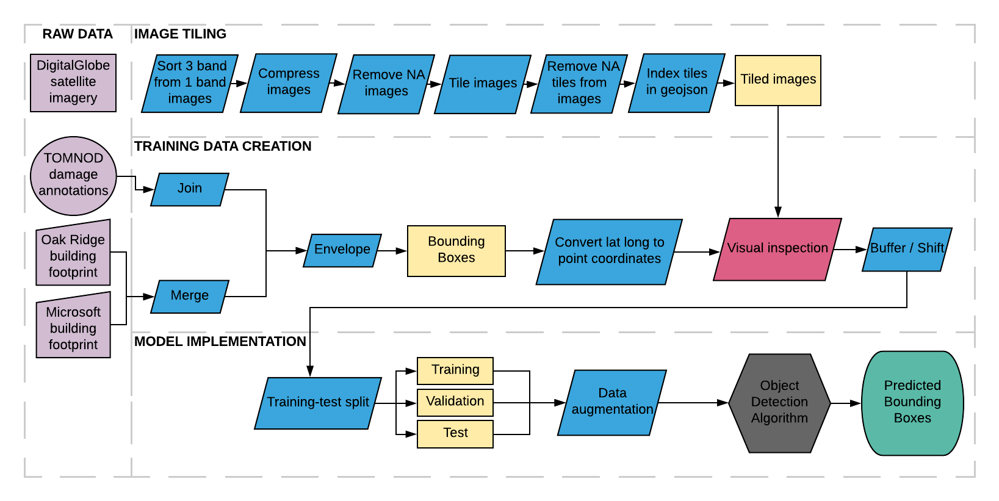

We considered several computer vision tasks to apply to our data, including classification, segmentation and object detection.  Classification would tell us whether a aignle object is or is not present in an image.  Segmentation would divide the image into regions with common properties, which has been applied to detecting flooded regions in satellite imagery.  We decided to apply object detection since it would detect and locate multiple real world objects in a given image.  Object detection would enable us to detect different objects that may be of interest to emergency managers, such as damaged buildings, damage debris, etc.  

Within object detection many algorithms have been developed, however we mainly considered Faster R-CNN (Ren et al., 2015) and Single Shot MultiBox Detector (SSD) (Liu et al., 2016), since these methods were being applied to satellite imagery data during the xView detection challenge.  Once we had our models selected, we were ready to develop our pipeline below.  

The pipeline is fairly complex, but essentially we start with the raw data which we pass through a series of processes, such as image tiling, data processing, training data creation and model training and inference.

Details on the run alternatives for image processing are detailed below.

Of all of the possible run alternatives, we selected three that would be most viable detailed in the figure below.

For additional documentation and scripts, please visit our github repository [here](https://github.com/DDS-Lab/disaster-image-processing).

