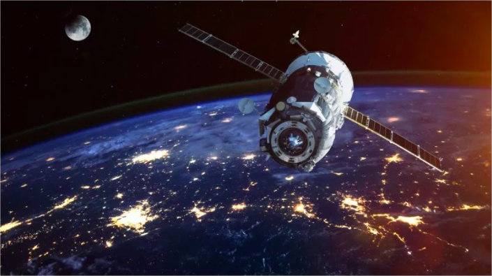

[(Image source)](https://www.thevintagenews.com/2017/11/28/abandoned-in-space-in-1967/)

# Automatic Damage Annotation on Post-Hurricane Satellite Imagery

The goal of this project is to use post hurricane satellite imagery data to 
train a machine learning algorithm to automatically detect damages from 
satellite images after hurricanes. Our goal is to develop a model that improves 
the damage assessment process for emergency managers. 

Specifically, we:

1. Gather, clean and prepare training datasets with annotations for damaged buildings and test datasets
   
2. Train the machine learning algorithm using the training data

3. Test the model on a test dataset
   
This is one of
[three projects](http://escience.washington.edu/2018-data-science-for-social-good-projects/)
from the 2018 Data Science for Social Good summer fellowship at the University
of Washington [eScience Institute](http://escience.washington.edu/).

## The Team

**Project Lead:**
[Youngjun Choe](http://escience.washington.edu/people/youngjun-choe/), Assistant Professor of Industrial & Systems Engineering and Director of the Disaster Data Science Lab, Aerospace & Engineering Research Building, University of Washington

**Data Scientist Lead:** [Valentina Staneva](http://escience.washington.edu/people/valentina-staneva/), Senior Data Scientist, eScience Institute

**DSSG Fellows:** Sean Chen, Andrew Escay, Chris Haberland, Tessa Schneider, An Yan
