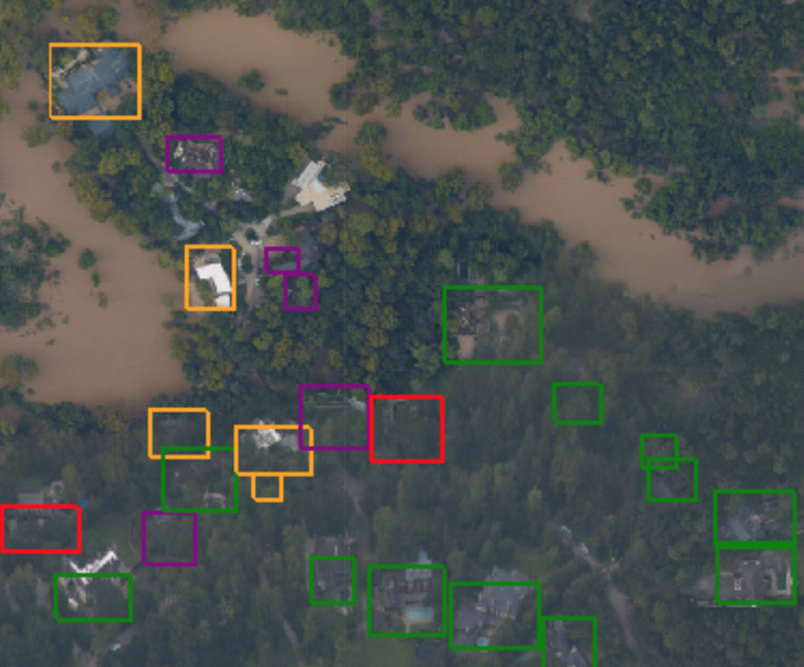
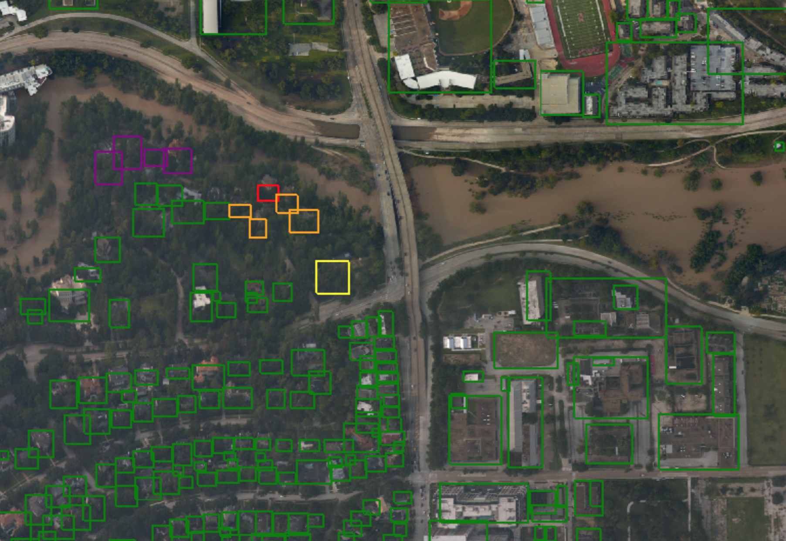

For more technical details on the steps involved in model training and inference, please visit our [github wiki](https://github.com/DDS-Lab/harvey_data_process/wiki).

For each training that we conducted, we were able to view the training loss and precision via the Tensorboard shown below:

1. Satellite RGB Imagery from Digital Globe using Single Shot Detector (SSD)

2. Aerial RGB Imagery from NOAA and FEMA

Red bounding boxes indicate damaged buildings and green bounding boxes indicate non-damaged buildings.

Green bounding boxes indicate non-damaged buildings and the other colored bounding boxes indicate damaged buildings of varying degrees.

